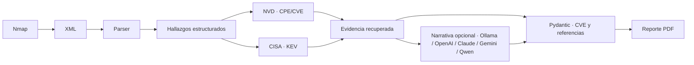

<div align="center">
  <h1>🛡️ NmapAutomator</h1>
  <p><strong>Nmap → NVD/CISA KEV → Security Analyst IA → PDF</strong></p>
  <p>Escaneo autorizado, hallazgos con evidencia y reportes listos para revisar.</p>
</div>


---

## Arquitectura



NVD/CISA aporta evidencia y datos verificables; la IA redacta el resumen, impacto y remediación. Las reglas determinísticas conservan la severidad y el estado del hallazgo, y Pydantic valida la salida antes de incluirla en el reporte.

## 📋 Características

| Característica | Detalle |
|---|---|
| 🖥️ Interfaz | Terminal con colores y barras de progreso (Rich + Typer) |
| 🎯 Entradas | IP, rango CIDR, rango con guión o archivo .txt |
| ⚡ Modos | Básico, Medio y Extremo |
| 🛡️ Metasploit | 48 rutas de módulo distintas en 20 combinaciones servicio/puerto |
| 🤖 Analista | Correlación opcional NVD/CISA KEV y narrativa con Ollama, OpenAI, Claude, Gemini o Qwen |
| 📄 Reporte | PDF profesional con hallazgos, vulns y recomendaciones |
| 🧹 Código | Modularizado, PEP 8, type hints, docstrings |

---

## 🏗️ Estructura del proyecto

```
nmap_automator/
├── core/
│   ├── __init__.py
│   ├── scanner.py             # Ejecución Nmap + parsing XML
│   ├── metasploit_mapper.py   # Base de datos MSF + enriquecimiento
│   ├── findings.py            # Hallazgos estructurados
│   ├── ai_schemas.py          # Schema Pydantic y validaciones de salida IA
│   ├── vulnerability_sources.py # Clientes NVD/CISA y caché local
│   └── security_analyst.py    # Correlación de evidencia y proveedores de narrativa IA
│
├── reports/
│   ├── __init__.py
│   └── pdf_report.py          # Generación de reporte PDF (ReportLab)
│
├── tests/                     # Pruebas locales, sin Nmap ni llamadas a API
│   ├── test_app_logging.py
│   ├── test_nmap_parser.py
│   ├── test_cve_matching.py
│   ├── test_finding_classification.py
│   ├── test_ai_output_schema.py
│   ├── test_provider_structured_output.py
│   ├── test_metasploit_mapping.py
│   └── test_report.py
│
├── utils/
│   ├── __init__.py
│   ├── ui.py                  # Banner, tablas Rich, confirmación
│   ├── validators.py          # Validación de IPs, CIDRs, hostnames
│   └── app_logging.py         # Registro de tracebacks de errores recuperables
│
├── output/                     # PDFs generados (ignorado por Git)
├── main.py                    # Entry point CLI (Typer)
├── requirements.txt
├── README.md
└── .gitignore
```

---

## ⚙️ Instalación

### Prerrequisitos

- Python 3.10+
- Nmap instalado en el sistema

```bash
# Arch / CachyOS / Manjaro
sudo pacman -S nmap

# Debian / Ubuntu / Kali
sudo apt install nmap

# macOS
brew install nmap
```

### Clonar e instalar

```bash
git clone https://github.com/Gythaaa/Nmap-Automator.git
cd Nmap-Automator
pip install -r requirements.txt
```

---

## 🚀 Uso

### Escaneo básico de una IP

```bash
python main.py --target 192.168.1.1
```

### Escaneo medio de un rango CIDR

```bash
python main.py --target 192.168.1.0/24 --mode medium --ports 1-65535
```

### Escaneo extremo desde archivo de IPs

```bash
python main.py --file targets.txt --mode extreme --output /tmp/reporte_red.pdf
```

### Omitir confirmación (modo automatizado / scripts)

```bash
python main.py --target 10.10.10.5 --mode medium --yes
```

---

## 📊 Modos de escaneo

| Modo | Flags Nmap | Descripción |
|---|---|---|
| `basic` | `-F --open` | 100 puertos más comunes, rápido |
| `medium` | `-sV -sC -O --open` | Versiones, scripts y detección de OS |
| `extreme` | `-A -p- --script vuln --open` | Todos los puertos + NSE vuln (lento) |

---

## 🔌 Integración Metasploit

La herramienta cruza automáticamente los servicios detectados con una base de datos interna de **48 rutas de módulo Metasploit distintas** distribuidas en **20 combinaciones servicio/puerto**, clasificadas por tipo (`auxiliary` / `exploit`) y cubriendo servicios como:

- FTP, SSH, Telnet, SMTP
- HTTP/HTTPS, SMB, RDP
- MySQL, PostgreSQL, MSSQL, MongoDB, Redis
- SNMP, LDAP, VNC, DNS

Los módulos sugeridos se muestran en la terminal y se incluyen en el reporte PDF. Las sugerencias se basan en el servicio/puerto y no prueban que el producto, la versión o una vulnerabilidad sean aplicables.

---

## 🤖 Analista de seguridad (NVD + CISA + proveedores IA)

El análisis de seguridad es opcional y se activa después del escaneo. Usa los CPE/versiones que Nmap haya identificado, consulta NVD y contrasta los CVE con el catálogo CISA KEV. Es una primera etapa de RAG estructurado: recupera registros por CPE/CVE y entrega su evidencia al generador; no necesita un índice vectorial para esta base de datos estructurada. Los resultados se clasifican como:

- **Candidato:** coincidencia de producto/CPE con NVD; requiere validar el rango afectado y posibles parches del fabricante.
- **Confirmado por NSE:** el resultado del script NSE indica explícitamente `VULNERABLE`.
- **Exposición observada:** servicio sensible detectado abierto; no implica que se haya probado autenticación ni explotación.

Una coincidencia NVD nunca se presenta por sí sola como prueba de vulnerabilidad. Se conservan severidad/CVSS, evidencia, confianza y referencias para incluirlos en el PDF.

### Correlación con fuentes públicas

```bash
python main.py --target 192.168.1.10 --mode medium --security-analysis
```

Esta opción consulta la API pública de NVD solo para los CPE con versión concreta que detectó Nmap y descarga el catálogo CISA KEV. Las respuestas se guardan durante 24 horas en la caché local. No se envían las IPs ni los hostnames escaneados a NVD o CISA. Sin una clave NVD, las consultas se espacian para respetar el límite público; se consultan como máximo cinco CPE distintos por escaneo.

Fuentes: [NVD CVE API 2.0](https://nvd.nist.gov/developers/vulnerabilities), [CISA KEV](https://www.cisa.gov/known-exploited-vulnerabilities-catalog) y [MITRE CWE](https://cwe.mitre.org/). Los avisos de fabricante se conservan cuando NVD los publica como referencias del CVE. Esta versión no infiere categorías OWASP a partir de puertos: para eso hacen falta hallazgos de capa de aplicación, no solo un banner de servicio.

Para usar una clave NVD opcional en PowerShell:

```powershell
$env:NVD_API_KEY = "tu-clave"
```

En Linux/macOS:

```bash
export NVD_API_KEY="tu-clave"
```

### Configuración del proveedor IA y consentimiento de datos

La narrativa puede generarse con Ollama local o con las API de OpenAI, Anthropic Claude, Google Gemini y Alibaba Cloud Model Studio (Qwen). `--ai-provider` selecciona el proveedor y activa `--ai`; si no se especifica, `--ai` conserva Ollama local como opción predeterminada. `--ai-model` permite reemplazar el modelo predeterminado para una ejecución.

Los proveedores cloud exigen una confirmación explícita en cada ejecución: `--allow-cloud-ai`. Al habilitarla, se enviarán al proveedor el servicio, producto/versión, evidencia técnica, CVE/CWE, referencias y datos relacionados necesarios para redactar la narrativa. **La IP y el hostname se omiten y se redactan por defecto.** Para incluir esos identificadores en la petición, habilita además `--share-target-identifiers`. Este consentimiento habilita la transferencia al proveedor; la retención y el tratamiento posterior dependen de la política de cada servicio.

Ejemplo con OpenAI, sin compartir IP/hostname:

```bash
python main.py --target 192.168.1.10 --mode medium --ai-provider openai --allow-cloud-ai
```

Ejemplo con Claude, autorizando también compartir IP/hostname:

```bash
python main.py --target 192.168.1.10 --mode medium --ai-provider claude --allow-cloud-ai --share-target-identifiers
```

Para fijar otro modelo en una ejecución:

```bash
python main.py --target 192.168.1.10 --ai-provider gemini --ai-model gemini-3.5-flash --allow-cloud-ai
```

Configura las claves como variables de entorno. No las pongas en los argumentos del comando, en el código ni en el repositorio.

| Proveedor | Variable para la clave | Modelo predeterminado | Variable opcional de endpoint |
|---|---|---|---|
| Ollama | No requiere | `qwen2.5:7b` | `NMAP_OLLAMA_URL` |
| OpenAI | `NMAP_OPENAI_API_KEY` | [`gpt-6-luna`](https://developers.openai.com/api/docs/models/gpt-6-luna) | `NMAP_OPENAI_BASE_URL` |
| Claude | `NMAP_ANTHROPIC_API_KEY` | [`claude-haiku-4-5-20251001`](https://platform.claude.com/docs/en/about-claude/models/whats-new-claude-4-5) | `NMAP_ANTHROPIC_BASE_URL` |
| Gemini | `NMAP_GEMINI_API_KEY` | [`gemini-3.5-flash`](https://ai.google.dev/gemini-api/docs/models/gemini-3.5-flash) | `NMAP_GEMINI_BASE_URL` |
| Qwen cloud | `NMAP_QWEN_API_KEY` | [`qwen-plus`](https://help.aliyun.com/en/model-studio/qwen-plus) | `NMAP_QWEN_BASE_URL` |

Los nombres de modelo también se pueden configurar mediante `NMAP_OLLAMA_MODEL`, `NMAP_OPENAI_MODEL`, `NMAP_CLAUDE_MODEL`, `NMAP_GEMINI_MODEL` y `NMAP_QWEN_MODEL`.

### Compatibilidad de salida

| Proveedor | Modelo predeterminado | JSON en la API | La API fuerza el esquema | Local |
|---|---|---|---|---|
| Ollama | `qwen2.5:7b` | ✅ [JSON Schema](https://docs.ollama.com/api/chat) | ✅ | ✅ |
| OpenAI | `gpt-6-luna` | ✅ [JSON Schema estricto](https://developers.openai.com/api/docs/guides/structured-outputs) | ✅ | ❌ |
| Claude | `claude-haiku-4-5-20251001` | ✅ [JSON Schema](https://platform.claude.com/docs/en/build-with-claude/structured-outputs) | ✅ | ❌ |
| Gemini | `gemini-3.5-flash` | ✅ [JSON Schema](https://ai.google.dev/gemini-api/docs/generate-content/structured-output) | ✅ | ❌ |
| Qwen cloud | `qwen-plus` | ✅ [JSON Object](https://help.aliyun.com/en/model-studio/qwen-structured-output) | ❌; Pydantic valida la estructura después | ❌ |

Todos los proveedores pasan además por validación Pydantic local, incluida la comprobación de IDs de hallazgo, CVE y referencias. En Ollama se envía el JSON Schema a la API local; en Claude, Gemini y OpenAI se activa la salida JSON Schema del proveedor. Qwen usa modo JSON Object, que garantiza JSON válido pero no impone el esquema completo.

En PowerShell, por ejemplo:

```powershell
$env:NMAP_OPENAI_API_KEY = "tu-clave"
python main.py --target 192.168.1.10 --ai-provider openai --allow-cloud-ai
```

En Linux/macOS:

```bash
export NMAP_OPENAI_API_KEY="tu-clave"
python main.py --target 192.168.1.10 --ai-provider openai --allow-cloud-ai
```

La URL de Model Studio y la clave de Qwen deben corresponder a la misma región. Puedes definir el endpoint indicado por Alibaba Cloud en `NMAP_QWEN_BASE_URL`.

Los IDs predeterminados enlazan a las fichas oficiales consultadas el 24-09-2026. El acceso depende de la cuenta, región y ciclo de vida de cada API; puedes cambiarlos con `--ai-model` o `NMAP_<PROVEEDOR>_MODEL`.

### Narrativa con Ollama local

Instala Ollama e inicia un modelo que admita salida JSON estructurada mediante su [API de chat](https://docs.ollama.com/api/chat). Por ejemplo:

```bash
ollama pull qwen2.5:7b
python main.py --target 192.168.1.10 --mode medium --ai
```

`--ai` también activa la correlación NVD/CISA y genera un resumen ejecutivo, impacto y remediación mediante Ollama local. El modelo no decide severidad, no crea CVE y no cambia el estado del hallazgo; las referencias se mantienen ligadas a las fuentes recuperadas. Por defecto se usa `http://127.0.0.1:11434` y el modelo `qwen2.5:7b`.

Ollama recibe los datos de hallazgos sin la IP ni el hostname del objetivo, salvo que añadas `--share-target-identifiers`. Si cambias `NMAP_OLLAMA_URL` para apuntarlo a otro equipo, trátalo como un endpoint externo: requiere también `--allow-cloud-ai`.

Se pueden cambiar los valores por variables de entorno:

```powershell
$env:NMAP_OLLAMA_URL = "http://127.0.0.1:11434"
$env:NMAP_OLLAMA_MODEL = "qwen2.5:7b"
```

La función de IA requiere que el proveedor elegido esté configurado y disponible. Si la generación de narrativa falla, el reporte se genera de todas formas con los datos determinísticos; la terminal muestra el error y la ruta del traceback completo en `output/nmap_automator.log` (o junto a la ruta indicada en `--output`). El escaneo normal, sin `--security-analysis` ni `--ai`, no hace consultas externas; el análisis NVD/CISA no recibe IPs ni hostnames.

---

## 🧪 Pruebas

Las pruebas usan XML de ejemplo, fuentes NVD simuladas y respuestas IA de muestra; no ejecutan Nmap ni llaman a proveedores:

```bash
python -m unittest discover -s tests -v
```

La validación IA usa Pydantic, verifica los IDs de hallazgo y las referencias contra la evidencia recuperada, y rechaza CVE no presentes o URLs no validadas. Estas reglas automatizadas no demuestran semánticamente cada afirmación en lenguaje natural.

## 📄 Reporte PDF

El reporte generado incluye:

1. **Portada** con métricas de resumen
2. **Resumen ejecutivo** con tabla por host
3. **Sección por host** con puertos, servicios, scripts NSE y módulos MSF
4. **Hallazgos del analista** con CVE/CWE, severidad, evidencia, confianza, referencias y remediación (cuando se activa el análisis)
5. **Resumen, impacto y remediación IA**, más la confianza autodeclarada de la narrativa (cuando se activa IA)
6. **Recomendaciones** dinámicas según servicios encontrados
7. **Aviso legal**

Los PDFs se guardan por defecto en `output/reporte_nmap.pdf`; la carpeta se crea automáticamente. Usa `--output` para cambiar la ruta. El código del generador permanece en `reports/`.

---

## ⚠️ Aviso legal

Esta herramienta es para uso exclusivo en **entornos autorizados** y con fines de **auditoría de seguridad ética**. El uso no autorizado contra sistemas ajenos es ilegal. El autor no se responsabiliza por el mal uso de esta herramienta.

---

## 📜 Licencia

MIT License — ver [LICENSE](LICENSE) para detalles.

---

## 👤 Autor

**Gythaaa** — Cybersecurity Junior | eWPTX | eJPT

- Plataforma: KaliLinux - Windows
- Especialización: Web Application Penetration Testing
```
